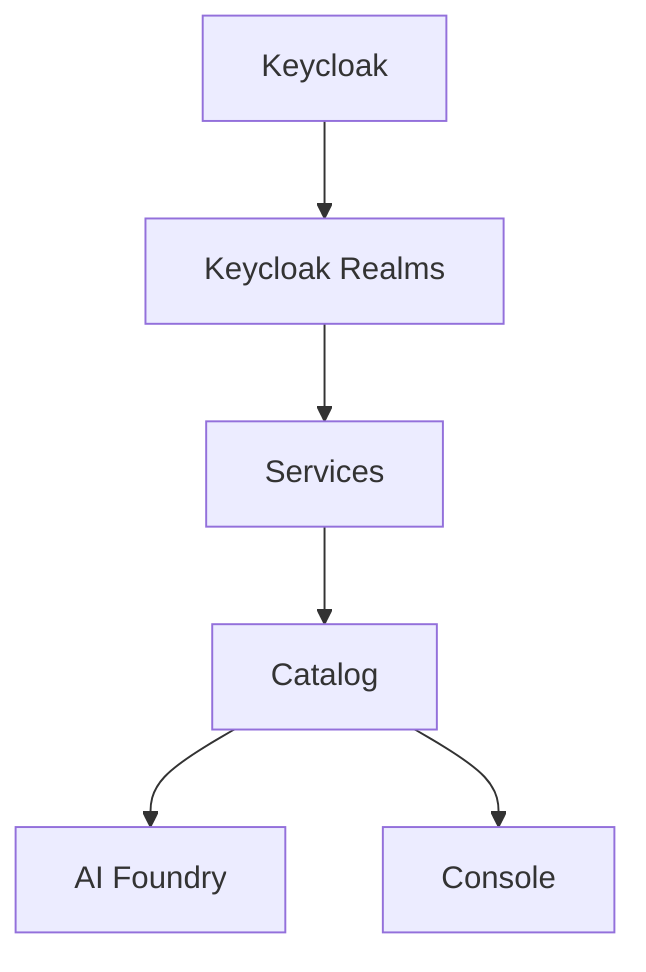

# Overview

This repository bundles Helm charts for the full Mia Platform product suite,
intended as a reference for installing the suite on your own Kubernetes
infrastructure.

## Components

| # | Component | Chart | What it is |
|---|---|---|---|
| 1 | Keycloak | `charts/keycloak` | The identity provider. Includes the `master` realm. |
| 2 | Keycloak Realms | `charts/keycloak-realms` | Configures the `products` and `extensibility` realms on top of the running Keycloak instance. |
| 3 | Services | `charts/services` | The platform homepage and the authorization (RBAC) service. |
| 4 | Catalog | `charts/catalog` | The Catalog product. |
| 5 | AI Foundry | `charts/ai-foundry` | The AI Foundry product. |
| 6 | Console | `charts/console` | The Console product. |

## Dependency order

Each component depends on the ones before it, so they must be installed in
sequence:



AI Foundry and Console both depend on Catalog and Services being in place,
but not on each other — they can be installed in either order, or together.

## What this repository is not

The `hacks/` folder and the root `Makefile`'s cluster-provisioning targets
(`00_init_docker` through `10_init_redis`) exist solely to stand up a local
`kind` cluster for development and testing of these charts. They are **not**
part of the product suite and are not something you need to run — the
datastores they install (PostgreSQL, MongoDB, Redis, Kafka) and the
ingress/TLS/DNS setup they perform stand in for infrastructure you are
expected to already have in your own environment. They are referenced in
this documentation only to identify what a given product needs (e.g. which
databases and schemas Catalog expects), not as an installation method.

> **OS support:** this local `kind`-based setup (the `hacks/` scripts and
> `make up`) has only been tested on Debian. It may not work as-is on other
> operating systems — this has no bearing on your own production
> infrastructure, since the charts themselves are what you'll actually be
> deploying there.

If you do want to run this local setup (e.g. to see the suite installed
end-to-end before adapting it to your own infrastructure), it expects the
following binaries on `PATH`:

| Binary | Used for |
|---|---|
| `docker` | Running the local `kind` cluster and the `keycloak-config-cli` realm-import containers. |
| `kind` | Creating/deleting the local Kubernetes cluster. |
| `kubectl` | All cluster interaction (installs, waits, CoreDNS/TLS patching, running SQL init scripts). |
| `helm` | Installing every chart, and rendering Keycloak realm templates (`template.sh`). |
| `mkcert` | Generating the locally-trusted TLS certificates (`hacks/tls.sh`), and trusting the CA cluster-wide (`hacks/kyverno.sh`). |
| `openssl` | Generating key material in `hacks/setup_keys.sh` (RSA keypair, cookie/token secrets). |
| `jq` | Assembling each chart's `.local/secrets.yaml` in the `render_values.sh` scripts. |
| `yq` | Same as above — pretty-prints the `jq` output as YAML. |
| `tar` | Reading rendered chart templates out of the dependency `.tgz` in `keycloak-realms/template.sh`. |

`awk` and `base64` are also used (CoreDNS patching, the `Makefile` help
target, and a few secrets scripts) but are standard on virtually any Linux
system, so they're not usually worth installing separately.

> **`/etc/hosts` is modified:** `hacks/tls.sh` appends entries to your
> local machine's `/etc/hosts` (via `sudo`) so the suite's hostnames resolve
> to `127.0.0.1`:
>
> ```
> 127.0.0.1 mia-platform.test
> 127.0.0.1 auth.mia-platform.test
> 127.0.0.1 home.mia-platform.test
> 127.0.0.1 catalog.mia-platform.test
> 127.0.0.1 ai-foundry.mia-platform.test
> 127.0.0.1 console.mia-platform.test
> 127.0.0.1 cms-console.mia-platform.test
> 127.0.0.1 *.mia-platform.test
> ```
>
> These lines are only added, never removed — nothing in this repository
> cleans them up automatically, including `make down`. Once you no longer
> need the local suite, remove them manually by editing `/etc/hosts` (e.g.
> `sudo sed -i '/mia-platform\.test/d' /etc/hosts`), otherwise those
> hostnames will keep resolving to `127.0.0.1` on that machine indefinitely,
> which can be surprising if you later reuse them for something else.

## Settings not suitable for production

Beyond the local-only tooling above, a few settings baked into the charts'
default `values.yaml` are appropriate for local development but should be
deliberately reconsidered before going to production:

- **Keycloak's TLS trust is built around a local dev CA.** `charts/keycloak/values.yaml`
  (`keycloak.truststores.mkcert`) configures Keycloak to trust a CA bundle
  distributed by `hacks/kyverno.sh` that includes the `mkcert` CA this
  repository generates for local certificates (see
  [`hacks/tls.sh`](../hacks/tls.sh)). In production, Keycloak's certificate
  and its truststore should come from your organization's real CA (or a
  public one), not from `mkcert` — otherwise you'd be trusting a
  locally-generated development CA in a production identity provider.
- **Console's CRUD encryption is disabled by default.** `charts/console/values.yaml`
  leaves `configurations.crudEncryption` commented out entirely, so Console
  runs without encrypting stored CRUD data at rest. This is fine for local
  development, but you should configure a real key provider (the chart
  supports GCP KMS, see the commented example in `values.yaml`) before
  storing real data in production. See [Console](08-console.md) for
  details.

Treat this list as a starting point, not exhaustive — review each product's
`values.yaml` against your own security requirements rather than assuming
the defaults shown in this repository are production-ready.
