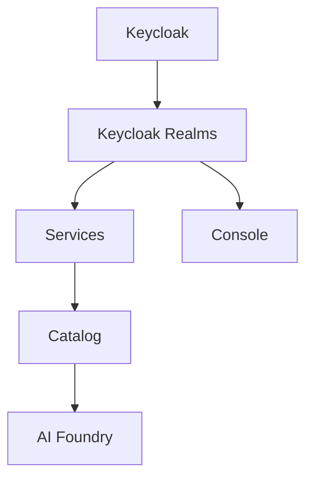

# Overview

This repository bundles Helm charts for the full Mia Platform product suite,
intended as a reference for installing the suite on your own Kubernetes
infrastructure.

## Components

| # | Component | Chart | What it is |
|---|---|---|---|
| 1 | Keycloak | `charts/keycloak` | The identity provider. Includes the `master` realm. |
| 2 | Keycloak Realms | `charts/keycloak-realms` | Configures the `products` and `extensibility` realms on top of the running Keycloak instance. |
| 3 | Services | `charts/services` | The platform homepage and the authorization (RBAC) service. |
| 4 | Catalog | `charts/catalog` | The Catalog product. |
| 5 | AI Foundry | `charts/ai-foundry` | The AI Foundry product. |
| 6 | Console | `charts/console` | The Console product. |

## Dependency order

Each component depends on the ones before it, so they must be installed in
sequence:



Console depends directly on Keycloak Realms and does not require Services,
Catalog, or AI Foundry to be installed first. AI Foundry depends on Catalog
and Services being in place.

## Installation layouts

The dependency order above is fixed, but *where* the products land is not.
There are two supported layouts:

### Namespace-per-product (default)

Each product gets its own namespace — `keycloak`, `services`, `catalog`,
`ai-foundry`, `console`. This is what every product page in this
documentation shows, and what you should normally do in your own
infrastructure: it keeps RBAC, network policies, resource quotas, and
`kubectl` blast radius scoped per product.

In this repository's local `kind` setup:

```
make 010_keycloak          # or: make 010_keycloak_native (no operator)
make 020_keycloak_realms
make 030_home
make 040_catalog
make 050_ai_foundry
make 060_console
```

### All-in-one

Every product is installed into a **single namespace** — `default` in the
local `kind` setup. This exists for constrained environments where a
namespace per product isn't practical (a shared cluster where you've been
given one namespace, a small demo/evaluation cluster, or a laptop where
fewer moving parts is simply easier to reason about).

```
make 010_keycloak_all_in_one   # or: make 010_keycloak_all_in_one_native
make 020_keycloak_realms_all_in_one
make 030_home_all_in_one
make 040_catalog_all_in_one
make 050_ai_foundry_all_in_one
make 060_console_all_in_one
```

Pick one layout and use it for the whole suite. Installing some products
namespace-per-product and others all-in-one is not a supported combination
— the cross-product URLs the charts are configured with assume a single
consistent layout.

#### What the all-in-one overlay changes

Services, Catalog, and AI Foundry are umbrella charts over a shared set of
components, so out of the box they produce **identically named resources**:
`api-gateway`, `authtool-bff`, `access-control`, `adk-be-app`, `cache`,
`swagger-aggregator`, `docling-service`, `mcp-server`, and the ConfigMaps,
Secrets, Services, ServiceAccounts, and PodDisruptionBudgets that go with
them. In separate namespaces that's harmless; in one namespace those three
releases would collide outright.

Each of those three charts therefore has a `values.all-in-one.yaml` overlay,
applied on top of its normal `values.yaml` by the `*_all_in_one` targets,
which sets a per-product `namespacePrefix`:

| Chart | Overlay | `namespacePrefix` | Resources become |
|---|---|---|---|
| `charts/services` | `values.all-in-one.yaml` | `svc` | `svc-api-gateway`, `svc-authtool-bff`, … |
| `charts/catalog` | `values.all-in-one.yaml` | `cat` | `cat-api-gateway`, `cat-authtool-bff`, … |
| `charts/ai-foundry` | `values.all-in-one.yaml` | `aif` | `aif-api-gateway`, `aif-authtool-bff`, … |

The prefix is applied by the underlying product charts themselves, so every
in-cluster reference between a product's own components (the envoy upstream
addresses in its API gateway config, for instance) is renamed consistently
along with the resources.

One reference is **not** derived automatically and is set explicitly in the
overlay: AI Foundry's `authtoolBffUrl`, which defaults to
`http://authtool-bff`, is overridden to `http://aif-authtool-bff` so it
still resolves to AI Foundry's own token-exchange service rather than
another product's.

**Keycloak and Console have no overlay**, for two different reasons:

- Keycloak's resource names don't collide with anything else in the suite,
  so it installs into the shared namespace unchanged.
- The Console chart does not support `namespacePrefix` at all, so it keeps
  the unprefixed names (`api-gateway`, `authtool-bff`,
  `swagger-aggregator`, `mcp-server`). That works *only* because all three
  of the other colliding products are prefixed — Console is the one release
  allowed to stay unprefixed. If you add another product to a shared
  namespace, give it a prefix of its own; don't drop one of the existing
  ones.

#### What the all-in-one layout does *not* change

- **The datastores stay where they are.** PostgreSQL, MongoDB, Redis, and
  Kafka are provisioned by the `hacks/` scripts into their own namespaces
  (`postgres`, `mongodb`, `redis`, `kafka`/`catalog`) in both layouts. Every
  connection string the charts use is a fully-qualified in-cluster name
  (e.g. `postgres-postgresql.postgres.svc.cluster.local:5432`,
  `catalog-kafka-kafka-bootstrap.catalog.svc:9092`), so it resolves the same
  either way. Note this means `hacks/kafka.sh` still creates Catalog's topics
  in the `catalog` namespace even when Catalog itself runs in `default`.
- **Hostnames, ingress routes, and TLS.** Products still talk to each other
  over their public URLs through the ingress, so the hostnames in
  [Prerequisites](20-prerequisites.md) are unchanged.
- **The realm import.** `020_keycloak_realms_all_in_one` is identical to
  `020_keycloak_realms`: `keycloak-config-cli` talks to Keycloak over the
  Admin REST API at its public URL, so no namespace is involved.
- **Secrets and shared key material.** The `authtoolBffKeys` material still
  has to match across Services, Catalog, and AI Foundry (see
  [Troubleshooting](90-troubleshooting.md#shared-secrets-must-match-across-products)).

### Keycloak run mode is a separate, orthogonal choice

The layout above decides *where* things go. Independently of it, Keycloak
can be run either through the Keycloak Operator (the default) or as a plain
StatefulSet with no operator — `keycloak-operator.mode: manual`, applied via
`charts/keycloak/values.native.yaml`. This choice affects **Keycloak only**;
no other product in the suite has an equivalent.

The two axes combine freely, so the local `kind` setup has a target for each
pairing:

| | Operator mode (default) | Native mode |
|---|---|---|
| Namespace-per-product | `make 010_keycloak` | `make 010_keycloak_native` |
| All-in-one | `make 010_keycloak_all_in_one` | `make 010_keycloak_all_in_one_native` |

Everything downstream is unaffected: Keycloak serves the same public URL in
both modes, and steps `020` onward are identical. See
[Keycloak: Run modes](30-keycloak.md#run-modes-operator-or-native) for the
trade-offs and constraints (native mode is single-instance).

### `NAMESPACE` is mandatory on the bare `make` targets

The numbered targets above are wrappers that pass the right namespace for
the layout you chose. The per-chart targets underneath them
(`keycloak_install`, `services_install`, `catalog_uninstall`,
`ai_foundry_uninstall`, `console_uninstall`, …) no longer carry a
hard-coded default namespace, so they must be invoked with `NAMESPACE`
explicitly:

```
make catalog_uninstall NAMESPACE=catalog        # namespace-per-product
make catalog_uninstall NAMESPACE=default        # all-in-one
```

Omitting it leaves `helm`'s `--namespace` empty, which silently falls back
to whatever namespace your current kubeconfig context points at — on an
all-in-one cluster that's `default`, i.e. exactly where your live releases
are. Always pass it.

## What this repository is not

The `hacks/` folder and the root `Makefile`'s cluster-provisioning targets
(`00_init_docker` through `10_init_redis`) exist solely to stand up a local
`kind` cluster for development and testing of these charts. They are **not**
part of the product suite and are not something you need to run — the
datastores they install (PostgreSQL, MongoDB, Redis, Kafka) and the
ingress/TLS/DNS setup they perform stand in for infrastructure you are
expected to already have in your own environment. They are referenced in
this documentation only to identify what a given product needs (e.g. which
databases and schemas Catalog expects), not as an installation method.

> **OS support:** this local `kind`-based setup (the `hacks/` scripts and
> `make up`) has only been tested on Debian. It may not work as-is on other
> operating systems — this has no bearing on your own production
> infrastructure, since the charts themselves are what you'll actually be
> deploying there.

If you do want to run this local setup (e.g. to see the suite installed
end-to-end before adapting it to your own infrastructure), it expects the
following binaries on `PATH`:

| Binary | Used for |
|---|---|
| `docker` | Running the local `kind` cluster and the `keycloak-config-cli` realm-import containers. |
| `kind` | Creating/deleting the local Kubernetes cluster. |
| `kubectl` | All cluster interaction (installs, waits, CoreDNS/TLS patching, running SQL init scripts). |
| `helm` | Installing every chart, and rendering Keycloak realm templates (`template.sh`). |
| `mkcert` | Generating the locally-trusted TLS certificates (`hacks/tls.sh`), and trusting the CA cluster-wide (`hacks/kyverno.sh`). |
| `openssl` | Generating key material in `hacks/setup_keys.sh` (RSA keypair, cookie/token secrets). |
| `jq` | Assembling each chart's `.local/secrets.yaml` in the `render_values.sh` scripts. |
| `yq` | Same as above — pretty-prints the `jq` output as YAML. |
| `tar` | Reading rendered chart templates out of the dependency `.tgz` in `keycloak-realms/template.sh`. |

`awk` and `base64` are also used (CoreDNS patching, the `Makefile` help
target, and a few secrets scripts) but are standard on virtually any Linux
system, so they're not usually worth installing separately.

> **`/etc/hosts` is modified:** `hacks/tls.sh` appends entries to your
> local machine's `/etc/hosts` (via `sudo`) so the suite's hostnames resolve
> to `127.0.0.1`:
>
> ```txt
> 127.0.0.1 mia-platform.test
> 127.0.0.1 auth.mia-platform.test
> 127.0.0.1 home.mia-platform.test
> 127.0.0.1 catalog.mia-platform.test
> 127.0.0.1 ai-foundry.mia-platform.test
> 127.0.0.1 console.mia-platform.test
> 127.0.0.1 cms-console.mia-platform.test
> 127.0.0.1 *.mia-platform.test
> ```
>
> These lines are only added, never removed — nothing in this repository
> cleans them up automatically, including `make down`. Once you no longer
> need the local suite, remove them manually by editing `/etc/hosts` (e.g.
> `sudo sed -i '/mia-platform\.test/d' /etc/hosts`), otherwise those
> hostnames will keep resolving to `127.0.0.1` on that machine indefinitely,
> which can be surprising if you later reuse them for something else.

## Settings not suitable for production

Beyond the local-only tooling above, a few settings baked into the charts'
default `values.yaml` are appropriate for local development but should be
deliberately reconsidered before going to production:

- **Keycloak's TLS trust is built around a local dev CA.** `charts/keycloak/values.yaml`
  (`keycloak.truststores.mkcert`) configures Keycloak to trust a CA bundle
  distributed by `hacks/kyverno.sh` that includes the `mkcert` CA this
  repository generates for local certificates (see
  [`hacks/tls.sh`](../hacks/tls.sh)). In production, Keycloak's certificate
  and its truststore should come from your organization's real CA (or a
  public one), not from `mkcert` — otherwise you'd be trusting a
  locally-generated development CA in a production identity provider.
- **Console's CRUD encryption is disabled by default.** `charts/console/values.yaml`
  leaves `configurations.crudEncryption` commented out entirely, so Console
  runs without encrypting stored CRUD data at rest. This is fine for local
  development, but you should configure a real key provider (the chart
  supports GCP KMS, see the commented example in `values.yaml`) before
  storing real data in production. See [Console](80-console.md) for
  details.

Treat this list as a starting point, not exhaustive — review each product's
`values.yaml` against your own security requirements rather than assuming
the defaults shown in this repository are production-ready.
